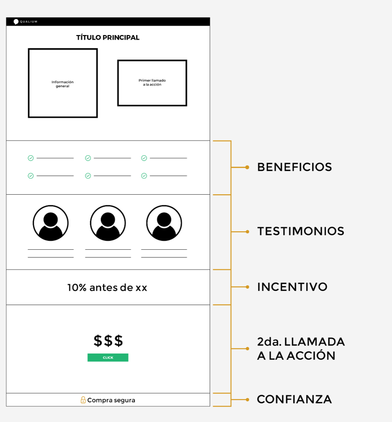

# Front End Checkpoint 1 

 Pilares de la web HTML y CSS

 Desarrolla una landing page en la que se pongan en práctica los temas vistos en clase

- Generar un documento index.html 
- Generar un documento .css
- Clonar la estructura del Wireframe del lado derecho usando las buenas prácticas de semántica de HTML

